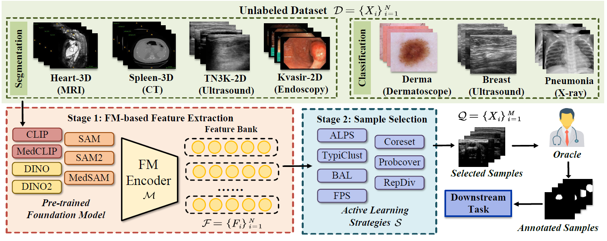
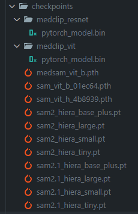

## MedCAL-Bench: A Comprehensive Benchmark on Cold-Start Active Learning with Foundation Models for Medical Image Analysis
### 0. Intro
* **Cold-Start Active Learning (CSAL)** aims to select informative samples for annotation without prior knowledge, which is important for improving annotation efficiency and model performance under a limited annotation budget in medical image analysis. Most existing CSAL methods rely on Self-Supervised Learning (SSL) on the target dataset for feature extraction, which is inefficient and limited by insufficient feature representation. Recently, **pre-trained Foundation Models (FMs)** have shown powerful feature extraction ability with a potential for better CSAL. However, this paradigm has been rarely investigated, **with a lack of benchmarks for comparison of FMs in CSAL tasks**. To this end, we propose **MedCAL-Bench**, the first systematic FM-based CSAL benchmark for medical image analysis. We evaluate 14 FMs and 7 CSAL strategies across 7 datasets under different annotation budgets, covering classification and segmentation tasks from diverse medical modalities. It is also the first CSAL benchmark that evaluates both the feature extraction and sample selection stages.  Our experimental results reveal that: **1)** Most FMs are effective feature extractors for CSAL, with DINO family performing the best in segmentation; **2)** The performance differences of these FMs are large in segmentation tasks, while small for classification; **3)** Different sample selection strategies should be considered in CSAL on different datasets, with Active Learning by Processing Surprisal (ALPS) performing the best in segmentation while RepDiv leading  for classification. 


### 1. Environment Setup
```sh
conda create -n MedCAL python=3.10
conda activate MedCAL
pip install -e . ./FM-AL/Foundation_models/CLIP ./FM-AL/Foundation_models/MedCLIP ./FM-AL/Foundation_models/segment_anything ./FM-AL/Foundation_models/sam2
```


### 2. Checkpoint and Dataset Preparation
#### 2.1 Checkpoint
* download checkpoints and place them at "./FM-AL/Foundation_models/checkpoints"
* 

#### 2.2 Dataset
Download dataset and place them as follows:
```sh
MedCAL-Bench/
└── data/
    └── dataset/
        └── {dataset_name}/
            ├── filename.npy
            ├── filename_label.npy
            ├── ....
            └── splits/
                ├── train.csv
                ├── valid.csv
                └── test.csv
```

##### Each csv file contains two columns "image_pth" and "mask_pth", which are the paths to the image and label files.


### 3. Extract features and select samples
```sh
cd FM-AL
# extract features
python foundation_feature.py --data_dir {dataset path} --model_version_type {foundation model and version type}

# select samples
python select_samples.py --foundation_models {foundation model and type} --organs {dataset name} --annotation_budgets {annotation budget} --AL_methods {active learning method}
``` 

### 4. Train models
```sh
cd train
bash command/run_Heart.sh
```

### 5. Citation
```sh

```